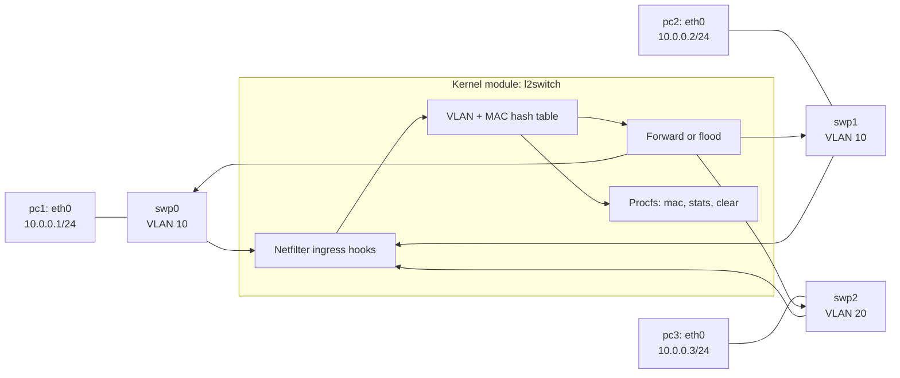

# Mini VLAN-Aware L2 Switch

This project is a small Linux kernel module that implements a learning Layer-2 Ethernet switch with static access-port VLANs. It is intended for kernel-networking experiments using Linux network namespaces and `veth` pairs.

The module currently provides:

- VLAN-aware source MAC learning
- Known-unicast forwarding
- Unknown-unicast flooding
- Broadcast and multicast flooding
- VLAN isolation between access ports
- Per-port traffic counters
- Procfs views for the MAC table and statistics
- A procfs write interface for clearing the learned MAC table

It does not implement 802.1Q tagged frames or trunk ports.

## Topology



| Switch port | Namespace peer | VLAN | Namespace address |
| --- | --- | --- | --- |
| `swp0` | `pc1` | 10 | `10.0.0.1/24` |
| `swp1` | `pc2` | 10 | `10.0.0.2/24` |
| `swp2` | `pc3` | 20 | `10.0.0.3/24` |

The ports are static access ports. Frames arriving on `swp0` or `swp1` can be forwarded between those ports, while traffic arriving on `swp2` cannot cross into VLAN 10.

## Packet-processing flow

1. A Netfilter `NF_NETDEV_INGRESS` hook receives a frame on one of the configured switch ports.
2. The module determines the ingress port and its configured VLAN.
3. The source MAC is learned under a `(VLAN, MAC)` key. Multicast and broadcast source addresses are not learned.
4. Broadcast, multicast, and unknown-unicast frames are flooded to other ports in the same VLAN.
5. A known unicast frame is cloned and transmitted only to the learned destination port when that port belongs to the same VLAN.
6. The original frame is dropped from the normal receive path because the module has handled the switching decision.
7. Counters and the learned table can be inspected through procfs.

Forwarding uses cloned `sk_buff` objects, restores Ethernet header space when needed, and transmits clones with `dev_queue_xmit()`.

## Repository files

- `l2switch.c` - kernel module implementation, VLAN mapping, MAC learning, forwarding, flooding, hooks, counters, and procfs handlers.
- `Makefile` - builds and cleans the module against the running kernel's headers.
- `setup.sh` - creates the three namespaces and `veth` topology, configures addresses, and brings interfaces up.
- `switchctl.sh` - reads the MAC table and statistics, displays VLAN configuration, or clears the MAC table.
- `cleanup.sh` - unloads the module and removes namespaces and switch interfaces.
- `tags` - generated Ctags index; it is not required to build or run the switch.

## Requirements

Run this project on Linux. The current Windows workspace is suitable for editing, but building and loading the module requires a Linux kernel environment such as a native Linux host or VM.

You need:

- A running Linux kernel with matching kernel headers
- `make` and a C compiler
- `iproute2` (`ip`, `ip netns`)
- Root privileges or `sudo`
- Kernel support for loadable modules, network namespaces, `veth`, Netfilter, and procfs

## Build and run

### 1. Build the module

```bash
make
```

This produces `l2switch.ko` for the running kernel.

### 2. Create the topology

```bash
sudo ./setup.sh
```

The script creates `pc1`, `pc2`, and `pc3`, connects them to `swp0`, `swp1`, and `swp2`, and assigns the VLAN layout shown above.

### 3. Load the module

```bash
sudo insmod l2switch.ko
```

The default module parameters expect the interfaces `swp0`, `swp1`, and `swp2` to exist before loading. The port names can be overridden at load time:

```bash
sudo insmod l2switch.ko port0=swp0 port1=swp1 port2=swp2
```

### 4. Exercise the switch

Traffic within VLAN 10 should work:

```bash
sudo ip netns exec pc1 ping -c 3 10.0.0.2
```

Traffic between VLAN 10 and VLAN 20 should be isolated:

```bash
sudo ip netns exec pc1 ping -c 3 10.0.0.3
```

The second command is expected to fail when the module is loaded and the topology is configured correctly.

### 5. Inspect and clear runtime state

```bash
sudo ./switchctl.sh vlan
sudo ./switchctl.sh mac
sudo ./switchctl.sh stats
sudo ./switchctl.sh clear
```

The equivalent procfs paths are:

- `/proc/l2switch/mac` - learned MAC addresses, VLAN IDs, ports, and entry age.
- `/proc/l2switch/stats` - per-port RX/TX, forwarding, flooding, drop, broadcast, multicast, unknown-unicast, and VLAN-drop counters.
- `/proc/l2switch/clear` - any write clears the learned MAC table.

Kernel messages can be viewed with:

```bash
dmesg | tail -50
```

### 6. Clean up

```bash
sudo ./cleanup.sh
```

The cleanup script attempts to unload `l2switch`, delete all three namespaces, and remove the switch-side `veth` interfaces.

## Make targets

```bash
make          # Build l2switch.ko
make clean    # Remove kernel build artifacts
make unload   # Remove the module
make logs     # Show recent kernel messages
```

The Makefile also declares `load` and `reload` targets, but the current `load` recipe contains a trailing `+++` after the module filename. Use the direct `insmod` command above until that recipe is corrected. The load and unload operations require root privileges and an already-created topology.

## Limitations

- The VLAN configuration is compiled in: `swp0` and `swp1` use VLAN 10, and `swp2` uses VLAN 20.
- VLANs are assigned by ingress port; there is no 802.1Q tag insertion, removal, or trunk support.
- The module supports exactly three configured ports by default.
- MAC entries are cleared manually or when the module is unloaded; there is no aging timer.
- This is an educational kernel module, not a production switch implementation.
