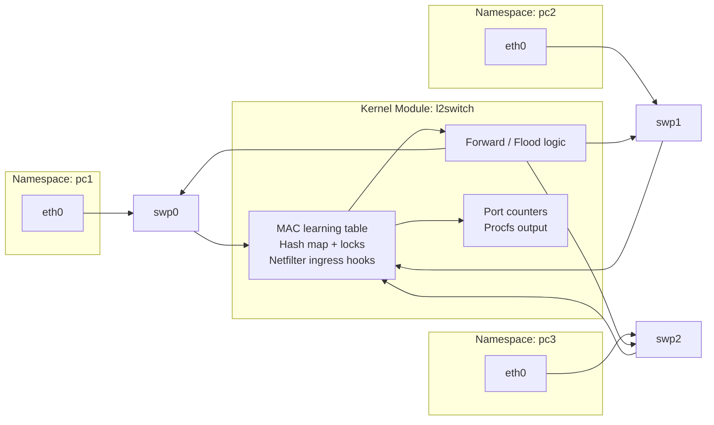

# Mini L2 Switch

This project is a small Linux kernel module that behaves like a basic Layer-2 Ethernet switch. It learns MAC addresses, forwards frames to the correct output port, floods unknown destinations, and exposes per-port statistics through procfs.

## Project architecture



This topology represents a three-port switch where each host is isolated in its own network namespace and connected through a `veth` pair. The kernel module sits between these interfaces and inspects every packet that enters the switch ports.

## How the switch works

1. A packet enters through one of the switch ports (`swp0`, `swp1`, or `swp2`).
2. A `netfilter` ingress hook captures the packet before normal networking continues.
3. The source MAC address is learned and mapped to the ingress port in the MAC table.
4. The destination MAC is looked up in the MAC table.
5. If the destination is known, the packet is forwarded to that port only.
6. If the destination is unknown, the packet is flooded to all ports except the source port.
7. Statistics such as forwarded, flooded, dropped, and transmitted packets are updated.
8. The runtime state is exposed through procfs so it can be inspected from user space.

## Why this matters

A real Ethernet switch works at Layer 2, where decisions are based on MAC addresses rather than IP addresses. The module mirrors that idea by observing each frame, learning where the source MAC lives, and deciding where the destination should go.

This is the same principle used in hardware switches and software-defined networking components: maintain a forwarding table, reduce unnecessary traffic, and keep per-port statistics for observation and debugging.

## Real-world switch behavior reflected in this code

- Source MAC learning: the switch remembers which source MAC belongs to which port.
- Destination lookup: the switch checks whether the destination MAC is already in the table.
- Unicast forwarding: a known destination is sent only to the matching port.
- Broadcast flooding: a broadcast frame is sent to all switch ports.
- Unknown unicast behavior: if no mapping exists, the frame is flooded to all ports.
- Port statistics: counters track how many packets were forwarded, flooded, dropped, or transmitted.
- Ingress and egress handling: packets are inspected at entry and then re-injected on the correct exit interface.

## Additional technical concepts in the module

### 14. Packet cloning and retransmission
The module does not modify the original packet in place. Instead, it creates a cloned `sk_buff` for the output interface and sends that clone using `dev_queue_xmit()`. This is common in kernel networking because it allows the same packet to be forwarded to multiple destinations while preserving the original for further processing.

### 15. Headroom management in `sk_buff`
When re-injecting a packet onto a different interface, the code ensures that there is enough headroom for the Ethernet header before calling `skb_push()`. This is important because kernel packet buffers may not always be laid out in a way that allows immediate header insertion.

### 16. Broadcast, multicast, and unknown-unicast handling
The switch explicitly avoids learning multicast or broadcast source addresses and treats some packet categories differently. Real switches use similar logic to prevent wrong entries in the forwarding table and to reduce unnecessary flooding.

### 17. User-space visibility through procfs
The module exposes state through procfs instead of keeping everything internal. This makes debugging much easier because user-space tools can read switch tables and counters without instrumenting the kernel in a heavy way.

### 18. Linux networking as a programmable environment
The project demonstrates that Linux can be used as a networking lab platform. Interfaces, namespaces, veth pairs, packet hooks, and custom kernel logic can all be combined to simulate a switch in software without requiring physical hardware.

## Technical concepts used

### 1. Linux kernel module
The switch is implemented as a loadable kernel module using:

- `module_init()` and `module_exit()`
- `MODULE_LICENSE`, `MODULE_AUTHOR`, `MODULE_DESCRIPTION`
- kernel APIs such as `kmalloc`, `kfree`, and `pr_info`

This is a classic example of how kernel code can extend the networking stack without changing the kernel source tree directly.

### 2. Network namespaces
The test topology uses Linux network namespaces to simulate separate hosts:

- `pc1`, `pc2`, and `pc3` are created with `ip netns add`
- Each namespace acts like an independent network stack
- This is useful for testing switching and forwarding behavior without real physical hardware

### 3. veth interfaces
The switch ports are created as virtual Ethernet devices:

- `swp0`, `swp1`, `swp2` are the switch-facing interfaces
- Each has a peer interface moved into a namespace (`pc1eth`, `pc2eth`, `pc3eth`)
- `veth` pairs are used to connect namespaces together as if they were connected by a cable

This makes the lab environment look like a small 3-port switch with 3 hosts attached.

### 4. MAC table and address learning
The module maintains a MAC learning table that maps source MAC addresses to a switch port:

- `struct mac_entry` stores `mac`, `dev`, and `last_seen`
- `learn_mac()` inspects each incoming source MAC
- If the MAC is new, it is inserted into the hash table
- If the MAC already exists, the port mapping is updated

This mimics the address-learning behavior of a real Ethernet switch.

### 5. Hash table implementation
The module uses the Linux kernel hash table API:

- `DEFINE_HASHTABLE(mac_table, MAC_HASH_BITS)`
- `hash_add`, `hash_for_each_possible`, `hash_for_each_safe`
- `struct hlist_node` for chaining entries
- `ether_addr_to_u64()` to derive a hash key from the MAC address

This allows fast lookups and updates instead of scanning a linear array.

### 6. Spin locks and concurrency safety
Kernel code must protect shared state from concurrent access:

- `DEFINE_SPINLOCK(mac_lock)`
- `spin_lock_bh()` and `spin_unlock_bh()`
- `mac_table` is protected because packets can arrive asynchronously on multiple ports

This is an important concept in kernel networking where packet processing can happen concurrently.

### 7. Proc filesystem
The module exposes operational data via procfs:

- `/proc/l2switch/mac` for the learned MAC table
- `/proc/l2switch/stats` for switch counters
- `proc_create_seq_private()` / `seq_file` style patterns are used in the kernel to read data safely

This is a simple way to inspect runtime state from user space.

### 8. Netfilter hooks
The switch intercepts ingress traffic using Netfilter hooks:

- `struct nf_hook_ops nf_ops[MAX_PORTS]`
- `NF_NETDEV_INGRESS` is used to process packets when they enter a device
- Hooks are registered for each switch port

The module uses these hooks to monitor and redirect Ethernet packets before standard forwarding logic continues.

### 9. Packet processing and switching behavior
The core switch logic includes:

- `learn_mac()` to record source MACs
- `lookup_mac()` to find a destination port from the MAC table
- `flood_packet()` to send a frame to all ports except the ingress port
- `forward_packet()` to send the frame to the known destination port

This matches the basic behavior of a Layer-2 switch:

- learn source addresses
- look up destination address
- forward directly when known
- broadcast/flood when unknown

### 10. Ethernet frame handling
Kernel packet processing revolves around `struct sk_buff` and network device metadata:

- `skb_clone()` duplicates a packet for transmission
- `skb_push()` restores Ethernet header space
- `skb_reset_mac_header()` resets the MAC header pointer
- `dev_queue_xmit()` sends the packet out a port
- `skb->dev` and `clone->dev` define the input and output interfaces

This is one of the most important technical concepts when working with Linux networking code.

### 11. Device and port indexing
The module maps interface names to port numbers using:

- `get_port_index()`
- `dev_get_by_name()`
- `strcmp(dev->name, port0)` / `port1` / `port2`

This maps each `net_device` to a logical switch port.

### 12. Port statistics and counters
The implementation tracks traffic counters per port:

- `rx_packets`
- `tx_packets`
- `forwarded`
- `flooded`
- `dropped`
- `broadcast`
- `multicast`
- `unknown_unicast`

These counters help visualize how many frames crossed each port and whether they were forwarded or dropped.

### 13. Kernel networking primitives and data structures
The file uses several important Linux kernel networking primitives:

- `struct net_device`
- `struct sk_buff`
- `struct hlist_node`
- `struct nf_hook_ops`
- `struct proc_dir_entry`
- `jiffies` for timing information
- `ETH_ALEN`, `ETH_HLEN`, and `IFNAMSIZ`

This project is therefore a practical example of kernel-level packet filtering, forwarding, and state tracking.

## File overview

- `l2switch.c` — core kernel switch implementation
- `Makefile` — builds the module for the running kernel
- `setup.sh` — creates the namespace + veth test topology
- `switchctl.sh` — reads MAC table and statistics from procfs
- `cleanup.sh` — removes namespaces and switch interfaces
- `.gitignore` — keeps generated kernel build artifacts out of Git

## Requirements

- Linux kernel headers for the running kernel
- Root privileges (`sudo`)
- A Linux system with `ip`, `ip netns`, and kernel module support

## Build

```bash
make
```

## Create the test topology

```bash
sudo ./setup.sh
```

## Load the module

```bash
sudo insmod l2switch.ko
```

## View switch data

```bash
sudo ./switchctl.sh mac
sudo ./switchctl.sh stats
```

## Remove topology and module

```bash
sudo ./cleanup.sh
```

## Notes

This project is intended for learning and experimentation in a Linux networking environment. It is not a production-ready switch implementation, but it demonstrates many core concepts used in real kernel networking and forwarding logic.
